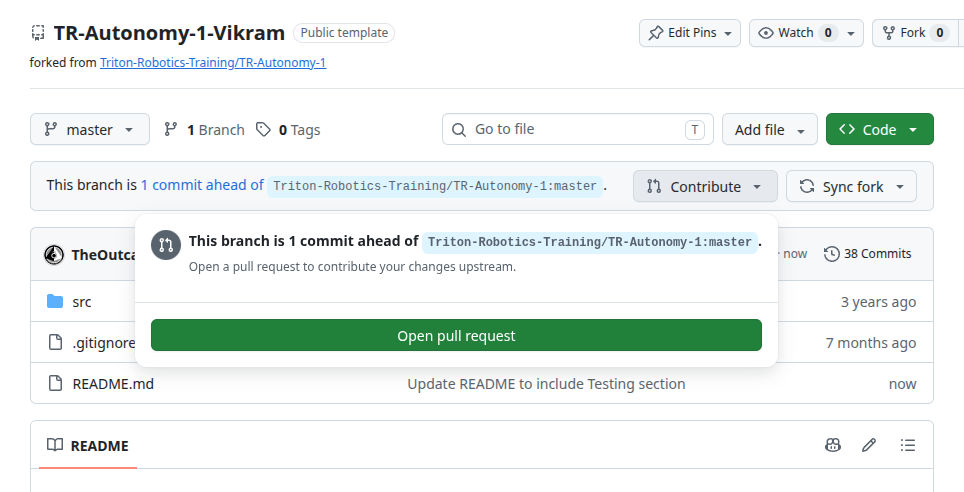
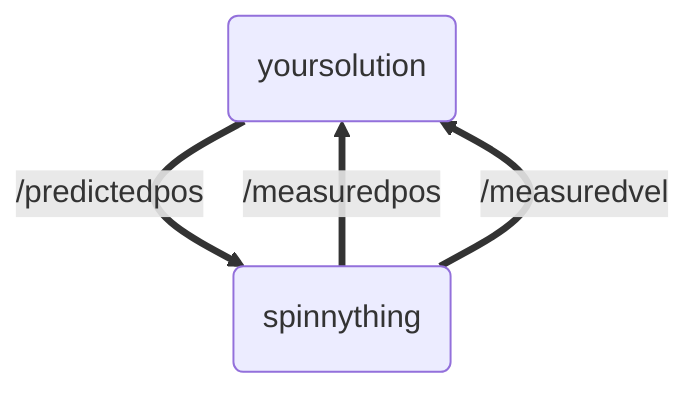

# TR-Autonomy-1
First Training Module for TR Autonomy Recruits

[](https://github.com/Triton-Robotics-Training/TR-CV-0/blob/main/resources.md)

## How to Work On and Submit This Assignment

**Read this before you clone anything.** Do not push directly to this repository. All work happens in your own fork.

1. Click "Fork" at the top right of this page, set the **Owner** to `Triton-Robotics-Training`, and name the fork so it's clearly yours, e.g. `TR-Autonomy-1-your-name`.

   

2. **Clone *your fork*** (not this repo) and do all of your work there:
   ```bash
   git clone git@github.com:Triton-Robotics-Training/TR-Autonomy-1-your-name.git
   ```
3. **Commit and push your work to your fork** as you go.
4. **When you're done, open a pull request** from your fork back to `Triton-Robotics-Training/TR-Autonomy-1` `master`. Once your fork is ahead of the upstream repo, GitHub shows a **Contribute → Open pull request** button on your fork's front page:

   

   That pull request is your submission. You do not need to do anything else to submit.

If you can't fork into the org because you don't have access, ask an autonomy lead to add you to the GitHub organization.

## Task Overview

This module works with [publishers and subscribers](https://docs.ros.org/en/humble/Tutorials/Beginner-Client-Libraries/Writing-A-Simple-Cpp-Publisher-And-Subscriber.html). A quick summary is that publishers can publish data to a topic (such as /measuredpos), and subscribers will receive that data.  
In this module, you will have available to you a topic that publishes the measured position and velocity of a target moving around a circle in 1.5 second intervals. Your task is to subscribe to the published data (part 1) and publish to your custom topic your predictions of where the data will be (part 2).

The below video shows what the tracker output should look like. The target is represented by `//` and our estimate is represented by `\\`. When they coincide, they are represented by `╳╳`

https://github.com/Triton-Robotics-Training/TR-CV-1/assets/33632547/c09eebcf-4f47-490b-9f65-17ddb58e281f

## Getting Started

Next you have to build the packages. 2 tools we use for building packages are [rosdep](https://docs.ros.org/en/jazzy/Tutorials/Intermediate/Rosdep.html) and [colcon](https://docs.ros.org/en/humble/Tutorials/Beginner-Client-Libraries/Colcon-Tutorial.html). To install them into your system, start by running these commands:
```
# install colcon
sudo apt install python3-colcon-common-extensions
# install rosdep
apt-get install python3-rosdep
# initialize rosdep (only need to do this once)
sudo rosdep init
rosdep update
```
[Workspaces](https://docs.ros.org/en/humble/Tutorials/Beginner-Client-Libraries/Creating-A-Workspace/Creating-A-Workspace.html) are directories for ROS2 packages. Each training assignment that we clone is going to be its own workspace. Starting by cloning **your fork** of the github repository in whichever directory you desire.
```
git clone YOUR_FORK_URL
```
Source the root setup file from your ros installation (typically in `/opt/ros/humble/setup.bash`) in the shell you are building in.
Then at the root of this workspace, first isntall any necessary dependencies using [rosdep](https://docs.ros.org/en/humble/Tutorials/Intermediate/Rosdep.html), then run `colcon build`. This generates an overlay with your packages. You then have to open a new terminal, navigate to your workspace directory, and `source install/setup.bash` to source your overlay. These set of commands commands are run every time you setup a new package. [Reference](https://docs.ros.org/en/humble/Tutorials/Beginner-Client-Libraries/Creating-A-Workspace/Creating-A-Workspace.html)
```
cd TR-Autonomy-1/
source /opt/ros/humble/setup.bash
rosdep install -i --from-path src --rosdistro humble -y
colcon build
# OPEN_NEW_TERMINAL AND NAVIGATE TO YOUR CLONED REPOSITORY
source install/setup.bash
```

If `rosdep install` gives you the error: "When using Python >= 3.11, PEP 668 compliance requires you to allow pip to install alongside externally managed packages using the 'break-system-packages' option." It simply means that users must allow pip to install packages system-wide to avoid system-breaking changes. You can either fix this by using a [virtual environment](https://packaging.python.org/en/latest/guides/installing-using-pip-and-virtual-environments/) or by setting the environment variable `PIP_BREAK_SYSTEM_PACKAGES=1` before running commands.

Finally, you can run the *spinnything* node which makes the target visualization, publishes the tracking data, and listens for the predicted position.
```bash
ros2 run spinnything spinnything
```

The output should look like the following. Notice the predicted position is not moving, 

https://github.com/Triton-Robotics-Training/TR-CV-1/assets/33632547/c80cfce8-6c66-4b9f-a2fd-f210406cc211

Whenever you make file changes, all you have to do is run colcon build and run the package again:

## Architecture

The point of this assignment is to get used to writing ROS2 publishers and subscribers in a non-trivial example.

When running spinnything, there is a spinnything node:
```bash
~/Documents/TR-CV-1$ ros2 node list
/spinnything
```

We can also see what topics there are:
```bash
~/Documents/TR-CV-1$ ros2 topic list
/measuredpos
/measuredvel
/parameter_events
/predictedpos
/rosout
```
The topics published by spinnything are `/measuredpos` and `/measuredvel`. We can check how often they are published:
```bash
~/Documents/TR-CV-1$ ros2 topic hz /measuredpos
average rate: 0.663
	min: 1.501s max: 1.517s std dev: 0.00821s window: 2
```
It is up to you to publish `/predictedpos` much faster than this:
```
~/Documents/TR-CV-1$ ros2 topic hz /predictedpos
average rate: 2000.087
	min: 0.000s max: 0.001s std dev: 0.00003s window: 2002
```

To do this, you write a node in the `your_solution` package



Basically, you listen to /measuredpos and /measuredvel from spinnything. Then, using that data you make predictions to /predictedpos, which spinnything subscribes to and updates the tracker accordingly. The messages are all of type `ArrayMsg = std_msgs::msg::Float64MultiArray`, the 0th entry is the x coordinate, the 1st entry is the y coordinate.

In order to predict the location of the target: use the following algorithm:

$\vec{x_p} = \vec{x} + \Delta t \vec{v}$

Where $x_p$ is the predicted position vector, $x$ and $v$ are previously measured position and velocity, and $\Delta t$ is the change in time since the measurement was received by your node.

## What you need to do:

### Part 1 (Optional)

Create a [node](https://docs.ros.org/en/humble/Tutorials/Beginner-CLI-Tools/Understanding-ROS2-Nodes/Understanding-ROS2-Nodes.html) (the code is set up for you in `spin_slow_update.cpp` and `spin_slow_update.h`) that takes the measured position and immediately republishes it to the predicted postion. The result should look like this:

https://github.com/Triton-Robotics-Training/TR-CV-1/assets/33632547/2b949c8f-c465-4124-879e-83cc3d86424f

### Part 2 (Required)

Create a node (the code is set up for you in `spin_sol.cpp` and `spin_sol.h`) that predicts the position of the target (using the algorithm above) and publishes it more frequently than the measurements. It should use a rclcpp wall timer callback to do this. The final product should look like this:

https://github.com/Triton-Robotics-Training/TR-CV-1/assets/33632547/c09eebcf-4f47-490b-9f65-17ddb58e281f

### __Before you write code__ setup a proper LSP

follow [this guide](https://github.com/Triton-Robotics/TR-Autonomy/blob/main/.md/cpp_python_lsp_setup.md) to setup clangd. This has significantly better performance than the microsoft C/C++ intellisense extension. Doing this is highly recommended

__If you cannot access that guide / the main TR-Autonomy repo please yell at your nearest autonomy lead to add you to the github : )__ 

__you will need to copy over the `colcon_defaults.yaml` and `.clang-format` files from the main `TR-Autonomy` repository where that guide lives__


### Submission Directions

Commit your completed code for Part 2 (and optionally Part 1) to **your fork**, push it, and open a pull request against `Triton-Robotics-Training/TR-Autonomy-1` `master`. See [How to Work On and Submit This Assignment](#how-to-work-on-and-submit-this-assignment) at the top of this README.

## Concepts You'll Need to Look Up

Below is a checklist of the things you will have to figure out how to write. We are deliberately not giving you the syntax, since part of this module is learning to read ROS2 and C++ documentation, which is what you'll be doing for the rest of your time on autonomy.

### ROS2 / rclcpp

- **Declaring a publisher**: the message type, the topic name, and the queue depth, and how you store the returned handle as a member.
  - [`Node::create_publisher`](https://docs.ros.org/en/humble/p/rclcpp/generated/classrclcpp_1_1Node.html#_CPPv4I000EN6rclcpp4Node16create_publisherENSt10shared_ptrI10PublisherTEERKNSt6stringERKN6rclcpp3QoSERK29PublisherOptionsWithAllocatorI10AllocatorTE)
- **Declaring a subscriber and binding a callback to it**: this is the part that trips most people up. Look at how the callback's signature has to match the message type, and how it gets attached to the subscription.
  - [`Node::create_subscription`](https://docs.ros.org/en/humble/p/rclcpp/generated/classrclcpp_1_1Node.html#_CPPv4I00000EN6rclcpp4Node19create_subscriptionENSt10shared_ptrI13SubscriptionTEERKNSt6stringERKN6rclcpp3QoSERR9CallbackTRK32SubscriptionOptionsWithAllocatorI10AllocatorTEN22MessageMemoryStrategyT9SharedPtrE)
  - See the "callback" section of the [pub/sub tutorial](https://docs.ros.org/en/humble/Tutorials/Beginner-Client-Libraries/Writing-A-Simple-Cpp-Publisher-And-Subscriber.html)
- **Wall timers**: how to make a callback fire on a fixed period. This is how Part 2 publishes faster than the measurements arrive.
  - [`Node::create_wall_timer`](https://docs.ros.org/en/humble/p/rclcpp/generated/classrclcpp_1_1Node.html#_CPPv4I000EN6rclcpp4Node17create_wall_timerEN6rclcpp9WallTimerI9CallbackTE9SharedPtrENSt6chrono8durationI12DurationRepT9DurationTEE9CallbackTN6rclcpp13CallbackGroup9SharedPtrE)
- **Getting the current time**: you need delta t since the last measurement, so you need a clock.
  - [`rclcpp::Clock` / `rclcpp::Time`](https://docs.ros.org/en/humble/p/rclcpp/generated/classrclcpp_1_1Clock.html)
- **Message types**: how a `.msg` definition maps onto the C++ type, and what fields `Float64MultiArray` actually has.
  - [`Float64MultiArray.msg` definition](https://github.com/ros2/common_interfaces/blob/humble/std_msgs/msg/Float64MultiArray.msg)

### C++

- **`std::bind` and `std::placeholders`**: the usual way callbacks get bound to member functions in rclcpp.
  - [cppreference: `std::bind`](https://en.cppreference.com/w/cpp/utility/functional/bind)
- **`std::chrono` durations and literals**: how you express "500ms" to a wall timer.
  - [cppreference: `std::chrono::duration`](https://en.cppreference.com/w/cpp/chrono/duration)

### Debugging tools

- **`ros2 topic` CLI**: `list`, `echo`, `hz`, and `info` will tell you whether your node is actually publishing, and whether anyone is listening. Use these before you start adding print statements.
  - [Understanding ROS2 topics](https://docs.ros.org/en/humble/Tutorials/Beginner-CLI-Tools/Understanding-ROS2-Topics/Understanding-ROS2-Topics.html)
- **`RCLCPP_INFO`**: ROS2's logging macros, which behave better than `std::cout` inside nodes.
  - [Logging in ROS2](https://docs.ros.org/en/humble/Tutorials/Demos/Logging-and-logger-configuration.html)

If you get stuck on any of these for more than a little while, ask in the #autonomy-support.
